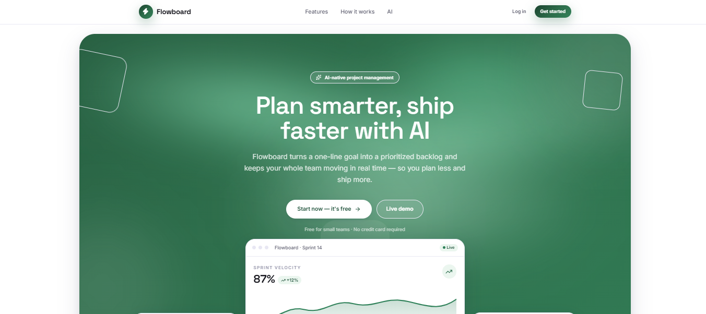
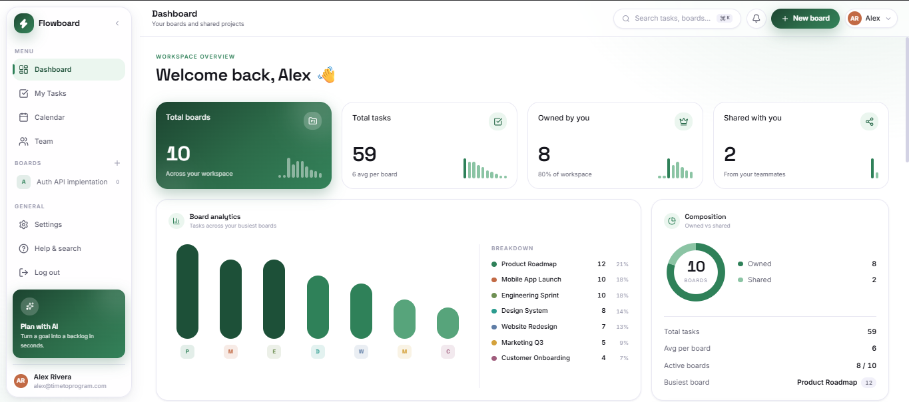
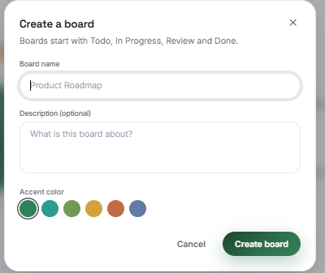
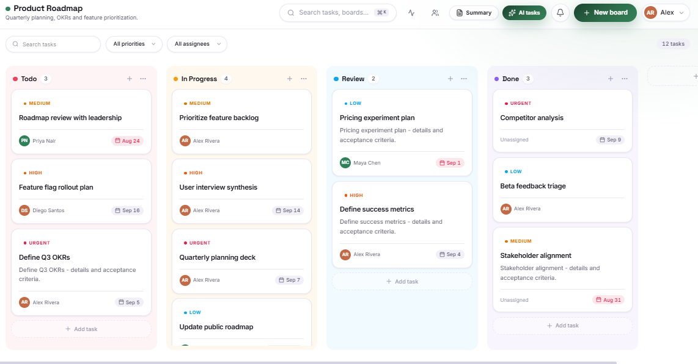
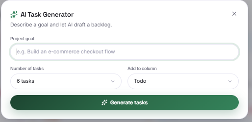
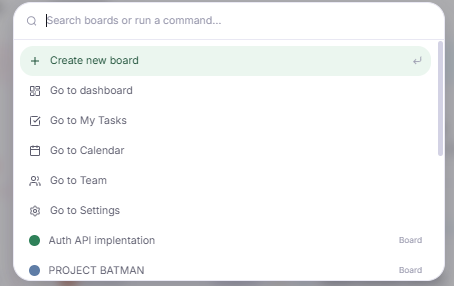

# Full-Stack AI Kanban Board (Flowboard)

> An AI-native, real-time project management platform built with the PERN stack, Google Gemini, Socket.IO, React 19, and Tailwind CSS v4.

<p align="center">
  
</p>

<p align="center">
  <a href="https://github.com/Christopher-Vhs/Full-Stack-AI-Kanban-Board-App">
    
  </a>
  
  
  
  
  
  
  
</p>

## Overview

**Flowboard** is a full-stack AI Kanban board for project management. A user can describe a goal in one line and let Google Gemini turn it into a prioritized backlog, break large tasks into subtasks, and summarize sprint progress.

The application also supports real-time team collaboration with Socket.IO, including live task updates, drag-and-drop synchronization, and presence. The backend follows a modular Express architecture and uses direct PostgreSQL queries through `pg`, while the frontend is built with React 19, Vite, Tailwind CSS v4, dnd-kit, and a hand-built shadcn-style component system.

Repository: **https://github.com/Christopher-Vhs/Full-Stack-AI-Kanban-Board-App**

## Features

- **Secure authentication** — Register and login with JWT authentication, bcrypt password hashing, protected routes, and session restoration on refresh.
- **Board management** — Create, rename, recolor, and delete boards, with separate owned and shared views plus live task counts.
- **Drag-and-drop Kanban** — Move and reorder cards across columns using dnd-kit and persist column/order changes to PostgreSQL.
- **Custom columns** — Add, rename, reorder, and delete board columns using position-based ordering.
- **Task management** — Full CRUD for title, description, priority, due date, assignee, and task details.
- **Board sharing** — Invite users, manage board membership, and support owner/admin/member access roles.
- **Real-time collaboration** — Socket.IO broadcasts task changes and presence events to connected teammates.
- **AI task generation** — Convert a project goal into a prioritized backlog using Google Gemini.
- **AI task breakdown** — Break large tasks into actionable subtasks.
- **AI sprint summaries** — Generate concise progress summaries from the current board state.
- **Dashboard analytics** — Board/task KPIs, workload analytics, ownership composition, and recent activity.
- **My Tasks** — Cross-board task view focused on work assigned to the current user.
- **Calendar** — Due-date based view of real project tasks.
- **Team directory** — View collaborators and board membership information.
- **Multi-tenant data access** — Board, column, task, and membership access is scoped to authorized users.
- **Responsive premium UI** — React 19, Tailwind CSS v4, Framer Motion, custom theme tokens, and reusable hand-built UI components.

## Screenshots

### Dashboard

<p align="center">
  
</p>

### Kanban Board

<p align="center">
  
</p>

### AI Task Generator

<p align="center">
  
</p>

### Command Menu

<p align="center">
  
</p>

### Create Board

<p align="center">
  
</p>

## Tech Stack

### Frontend

| Technology | Purpose |
|---|---|
| React 19 | UI and component architecture |
| Vite 8 | Development server and production builds |
| Tailwind CSS v4 | Styling and responsive design |
| Framer Motion | UI animations |
| React Router | Client-side routing |
| Axios | REST API requests |
| dnd-kit | Drag-and-drop and sortable Kanban interactions |
| Socket.IO Client | Real-time events and presence |
| date-fns | Date utilities |
| Lucide React | Icons |
| React Hot Toast | User notifications |

### Backend

| Technology | Purpose |
|---|---|
| Node.js | JavaScript runtime |
| Express.js | REST API server |
| PostgreSQL | Relational database |
| Neon | Hosted PostgreSQL |
| `pg` | Direct PostgreSQL queries |
| Socket.IO | Real-time collaboration |
| JWT | Authentication tokens |
| bcryptjs | Password hashing |
| Google Gemini / `@google/genai` | AI task generation and summarization |
| dotenv | Environment configuration |
| CORS | Frontend/backend cross-origin access |

## Architecture

```text
                         ┌──────────────────────────┐
                         │      React + Vite        │
                         │  Tailwind / dnd-kit UI   │
                         └────────────┬─────────────┘
                                      │
                         REST API     │     Socket.IO
                                      │
                         ┌────────────▼─────────────┐
                         │    Node.js + Express     │
                         │                         │
                         │ Routes → Controllers    │
                         │        → Services       │
                         └──────┬───────────┬──────┘
                                │           │
                           SQL  │           │ AI requests
                                │           │
                     ┌──────────▼───┐   ┌───▼────────────┐
                     │ PostgreSQL   │   │ Google Gemini  │
                     │    Neon      │   │      API       │
                     └──────────────┘   └────────────────┘
```

## Project Structure

```text
Full-Stack-AI-Kanban-Board-App/
│
├── backend/
│   ├── src/
│   │   ├── config/
│   │   │   └── db.js
│   │   ├── controllers/
│   │   ├── db/
│   │   │   ├── init.js
│   │   │   ├── schema.sql
│   │   │   └── seed.js
│   │   ├── middleware/
│   │   ├── realtime/
│   │   ├── routes/
│   │   ├── services/
│   │   ├── socket/
│   │   └── utils/
│   ├── index.js
│   ├── package.json
│   └── package-lock.json
│
├── frontend/
│   └── AIKanbanBoard/
│       ├── public/
│       ├── src/
│       │   ├── assets/
│       │   ├── components/
│       │   │   ├── ai/
│       │   │   ├── auth/
│       │   │   ├── board/
│       │   │   ├── landing/
│       │   │   ├── layout/
│       │   │   └── ui/
│       │   ├── context/
│       │   ├── hooks/
│       │   ├── lib/
│       │   ├── pages/
│       │   └── routes/
│       ├── package.json
│       └── vite.config.js
│
├── docs/
│   └── screenshots/
│
├── .gitignore
└── README.md
```

## Getting Started

### Prerequisites

Install the following before running the project:

- Node.js
- npm
- A Neon/PostgreSQL database
- A Google Gemini API key
- Git

## 1. Clone the Repository

```bash
git clone https://github.com/Christopher-Vhs/Full-Stack-AI-Kanban-Board-App.git
cd Full-Stack-AI-Kanban-Board-App
```

## 2. Backend Setup

```bash
cd backend
npm install
```

Create:

```text
backend/.env
```

Example:

```env
PORT=5050
NODE_ENV=development
CLIENT_URL=http://localhost:5173

DATABASE_URL=your_neon_postgresql_connection_string

JWT_SECRET=your_secure_jwt_secret

GEMINI_API_KEY=your_google_gemini_api_key
GEMINI_MODEL=your_supported_gemini_model
```

> Never commit your real `.env` file or credentials to GitHub.

### Initialize the Database

```bash
npm run db:init
```

### Seed Demo Data

```bash
npm run db:seed
```

### Start the Backend

Development:

```bash
npm run dev
```

Production-style start:

```bash
npm start
```

By default, the API runs at:

```text
http://localhost:5050
```

## 3. Frontend Setup

Open a second terminal:

```bash
cd frontend/AIKanbanBoard
npm install
```

Create:

```text
frontend/AIKanbanBoard/.env
```

Example:

```env
VITE_API_URL=http://localhost:5050/api
VITE_SOCKET_URL=http://localhost:5050
```

Start Vite:

```bash
npm run dev
```

The frontend will normally run at:

```text
http://localhost:5173
```

## Available npm Scripts

### Backend

| Command | Description |
|---|---|
| `npm run dev` | Start the API with Node watch mode |
| `npm start` | Start the backend normally |
| `npm run db:init` | Initialize the PostgreSQL schema |
| `npm run db:seed` | Seed demo data |

### Frontend

| Command | Description |
|---|---|
| `npm run dev` | Start the Vite development server |
| `npm run build` | Build the frontend for production |
| `npm run lint` | Run ESLint |
| `npm run preview` | Preview the production build |

## AI Features

Flowboard integrates Google Gemini through the backend rather than exposing AI credentials in the browser.

### Task Generation

A user provides a short goal such as:

```text
Prepare a product launch
```

Flowboard sends the goal to the backend, Gemini produces a structured backlog, and the generated tasks can be inserted into a selected board column.

### Task Breakdown

Large tasks can be converted into smaller, actionable subtasks while keeping the original task as the parent work item.

### Sprint Summary

The application can provide Gemini with board context and return a human-readable overview of:

- completed work,
- work in progress,
- remaining tasks,
- priorities,
- overall sprint progress.

## Real-Time Collaboration

Socket.IO provides live team collaboration.

Clients authenticate their socket connection using the current JWT and join board-specific rooms after the backend verifies board access.

Real-time events support capabilities such as:

- live board presence,
- task updates,
- task movement,
- synchronized edits,
- board-specific broadcasts,
- teammate join/leave events.

This keeps connected clients synchronized without requiring repeated manual refreshes.

## Authentication & Authorization

Flowboard uses:

```text
Registration/Login
       ↓
bcrypt password hashing
       ↓
JWT issued by backend
       ↓
Protected REST routes
       ↓
Board membership / ownership checks
       ↓
Authorized data only
```

JWT authentication is also used when establishing Socket.IO connections.

## Database

The backend uses PostgreSQL hosted on Neon and communicates with it directly through the `pg` package instead of an ORM.

The data model is designed around project-management entities such as:

```text
Users
  │
  ├── Boards
  │     ├── Board Members
  │     └── Columns
  │           └── Tasks
  │                 └── Subtasks
  │
  └── Activity
```

Direct SQL keeps database behavior explicit and allows the application to make use of PostgreSQL relationships, constraints, joins, transactions, and ordering.

## Backend Design

The backend follows a modular flow:

```text
Request
   ↓
Route
   ↓
Authentication / Middleware
   ↓
Controller
   ↓
Service
   ↓
PostgreSQL / Gemini / Realtime layer
   ↓
Response
```

This separation keeps request handling, business logic, external services, authentication, and database operations easier to maintain.

## Security Notes

- Passwords are hashed with bcryptjs.
- Protected endpoints require JWT authentication.
- Board access is checked against ownership and membership.
- Gemini credentials remain server-side.
- PostgreSQL credentials are stored in environment variables.
- `.env` and `node_modules` should remain excluded through `.gitignore`.
- API secrets should never be embedded in frontend source code.

## Deployment

The project is **not deployed yet**.

A future deployment can use:

- a static/frontend host for the React application,
- a Node.js-compatible backend host with WebSocket support,
- Neon for PostgreSQL,
- production environment variables for database, JWT, Gemini, CORS, API, and Socket.IO configuration.

Because Flowboard uses Socket.IO, the chosen backend host must support persistent WebSocket connections.

## Future Improvements

Potential future additions include:

- notifications and mentions,
- comments and task discussions,
- file attachments,
- richer board activity history,
- recurring tasks,
- advanced filtering and saved views,
- AI-based workload estimation,
- AI sprint planning,
- email invitations,
- production deployment and CI/CD,
- automated backend and frontend test suites.

## License

The backend package is currently configured with the **ISC License**.

If you intend the whole repository to be open source, add a root `LICENSE` file so the repository-level licensing terms are explicit.

## Author

**Christopher Wawa**

GitHub: [Christopher-Vhs](https://github.com/Christopher-Vhs)

Project repository: [Full-Stack AI Kanban Board (Flowboard)](https://github.com/Christopher-Vhs/Full-Stack-AI-Kanban-Board-App)

---

If you find this project useful, consider giving the repository a ⭐.
